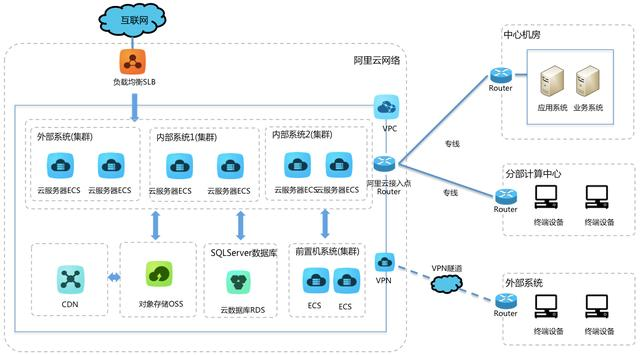
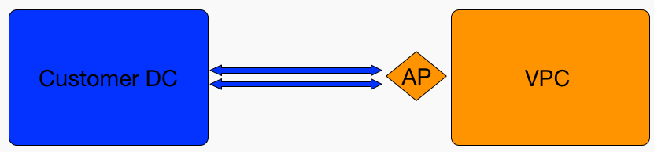
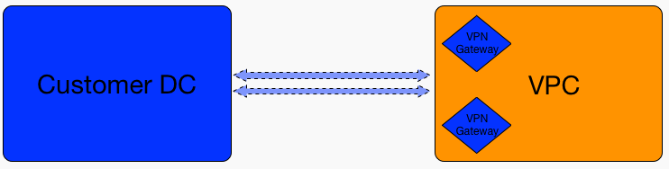
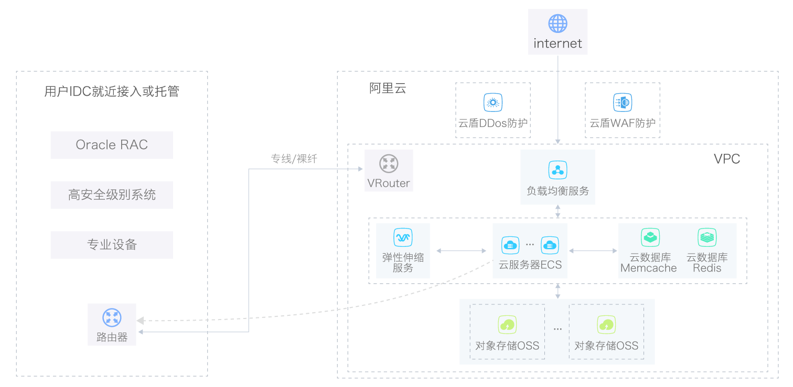

#内网外网数据通信解决方案

---

###阿里云VPC

专有网络(Virtual Private Cloud), 基于阿里云构建出一个(逻辑)隔离的网络环境.可以完全掌控自己的虚拟网络,包括选择自有 IP 地址范围,划分网段,配置路由表和网关等.

也可以通过专线/ VPN 等连接方式将 VPC 与传统数据中心组成一个按需定制的网络环境.

###解决方案

上图描述了线下IDC机房与阿里云VPC打通的方式,利用专线或者公网网络建立隧道VPN通道.

####物理专线接入,官方提供的解决方案

通过物理专线将自有数据中心和阿里云VPC连接起来,实现用户网络与阿里云专有网络之间的内网互通.

VPC高速通道特点是速度快、稳定、延时低，非常适合对带宽、速度和稳定些要求很高，需要长时间传输大批量数据的用户.

**开通流程**

1. 开通VPC
2. 提交工单,支付费用
3. 专线施工
4. 路由配置

####vpn接入

在VPC内使用ECS自建VPN网关,实现用户网络与阿里云专有网络之间的内网互通.

VPN公网接入的特点是数据自主加密、使用方便、价格低廉、实施时间短，适合对价格敏感、数据传输量小、线路质量要求一般的客户.

###混合云案例(专线接入)

**中国石化**

**12306**

**中国银河证劵**

**央视**

**新浪微博**

**浙江交通**

**芒果TV**

**海淀政务云**

###解决方案

####混合云解决方案

线下数据库,我们通过专线打通线下和线上.这样我们就如我们正常访问数据库资源一样.通过专线解决2个不同环境的数据通道.

**人员配置方案一: 2人**

1. 网络工程师: 提供网络解决方案(设计搭建公司云端vpc, 打通vpc和线下idc),云端vpn搭建.协助一起维护容器云.
2. 运维人员: 维护线下idc,数据库和服务器,备份和正常维护.和网络工程师一起协作维护线下数据. 维护线上云服务器.保障线下idc正常运行.监控以及日志.

**人员配置方案二: 1人**

1. 运维人员: 提供网络解决方案,了解vpc,维护线下idc服务器.打通云端和线下数据. 维护线上云服务器.了解至少一门编程语言.协助一起维护容器云.

####vpc隔离方案

我们把敏感数据通过云端`vpc`把`rds(数据库)`隔离(网络逻辑)出来,使用`全部云`方案.

**人员配置: 1人**

1. 网络工程师(设计搭建公司云端vpc, 打通vpc和线下idc),协助搭建云端vpn搭建.了解至少一门编程语言.协助一起维护容器云.

