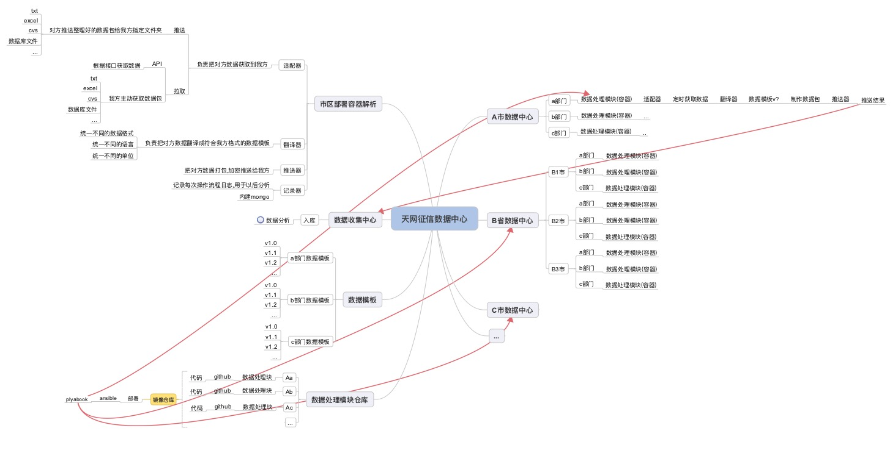

#政府征信网站对接方案

---

###方案

####方案解释

* `适配器`: 解决获取数据方式的文件
* `翻译器`: 翻译不同数据源为我方数据源的文件

一组`适配器`+`翻译器`可以为一个数据源提供一套解决方案.

通过容器封装一组适配器+翻译器,为不同的数据源提供解决方案.同时使用容器来解决更新问题.方便我们同意管理代码的部署与更新.

####为什么要规范数据样本

我们通过前期调研,尽量获取多个市多个部门的样本模板.然后整理出一个`v1.0`版本的.我们希望借助版本不`不同`市区`不同`部门的数据能统一成一种模式的数据.

版本的升级为向前兼容,即新版本的数据模板`兼容`低版本的数据模板.`兼容`包括:

* 数据字段`包含`

		原来的数据模板为  a, b, c 
		更新后为 a, b, c, d, e 
		
		我们更新后的数据字段比原来的多(a,b,c,d,e 包含 a,b,c)
		
* 数据字段`转换`

		原来的数据模板为 a, b, c, d, e
		更新后为 a, b, f 
		其中 f = 公式(c + d + e)

可以通过该规范把技术层级从具体的地区解耦开:

* 无论接收的数据源是哪个市区,那种获取数据形式,那种数据的格式,最终我们只处理符合`规范`的数据包(数据包格式由我们自己制定)
* 每个市区的自己的数据中心负责`获取`,`翻译`,`打包`,`推送`给我方.可以针对各个市区做单独的部署和调度.即使一个市区的数据中心宕机,也不会影响总体数据中心.

#####业务解决场景

我们通过针对每个部门不同的`翻译器`开发,可以把不同的数据样本换成相同的数据.以某市某单位为例:假设对方提供已有的数据文件为excel格式.

**部署场景**

* 我们根据对方数据确定方案,选择使用excel解析适配器
* 我们根据对方数据格式,开发专门的翻译器
* 我们通过容器模式,把我们各个组件打包,通过`ansible`(服务端无需安装任何东西),远程推送到对方数据中心.
* 我们部署好的组件,设定时间:
	* 可更新时间,方便我们选择更新策略.
	* 获取数据时间(如果是拉的方案)
* 所有组件联合运行完成后,把最终数据推送给我方

**更新场景**

* 我们需要更新某市某单位的数据处理模块
* 我们根据提前设定好的`可更新时间`通过`ansible`进行推送
	* 首先我们开启新的数据模块
	* 原型内置冒烟自动化测试,确认所有组件正常
	* 关闭旧的容器(不是删除)
* 运行一段时间后
	* 运行正常
	* 运行不正常,需要回滚,则关闭新版本的容器,启动旧版本的容器即可.

####示例图

###数据获取方案

####推送方案

#####数据方有技术团队支撑

1. 技术团队整理好数据后, 定期推送给我方
2. 我方可采用如下方案:
	* 使用`python`脚本监控文件夹
	* 当有指定文件导入后通过适配器文件解析文件
	* 使用翻译器文件翻译为我放数据
	* 导入我方数据库
3. 支持的文件:
	* text
	* excel
	* cvs
	* 数据库文件
	* 各种文本文件...

#####API方式

我方提供统一的接口,可以使用标准的RESTAPI形式把数据录入我方数据源内.

####拉取方案

数据方在准备好数据后,通过我方设定好的`接口`,触发通知给我方.我方收到请求后,主动通过提前约定好的获取地址获取数据文件.获取文件后通过`适配器`+`翻译器`入库我方数据库

#####数据方无技术团队支撑

对方提供一种获取数据源的方式,假设给予一个仅具有`读`权限的账户.

1. 我放需要通过在服务器部署`python`脚本,定期使用适配器文件数据源获取数据
2. 使用翻译器文件翻译为我方可录入数据
3. 导入我方数据库
4. 支持的文件:
	* text
	* excel
	* cvs
	* 数据库文件
	* 各种文本文件...

###需要解决的问题

1. 我们需要确定自己的数据格式,也就是无论我们从哪个省市区县获取类似部门数据,比如某一类的数据需要统一我们的格式,也就是用对方的数据对接我们的数据格式
2. 确认我方使用的编程语言,需要有样本数据的情况下对比分析下.目的是尽量根据适当的方案,选择不同的语言.
3. 确认大数据分析方法
